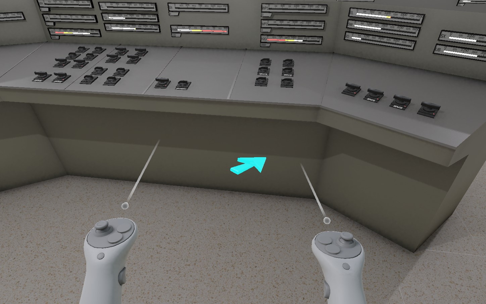
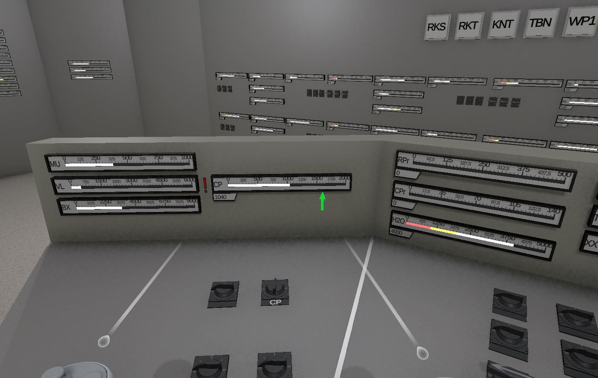
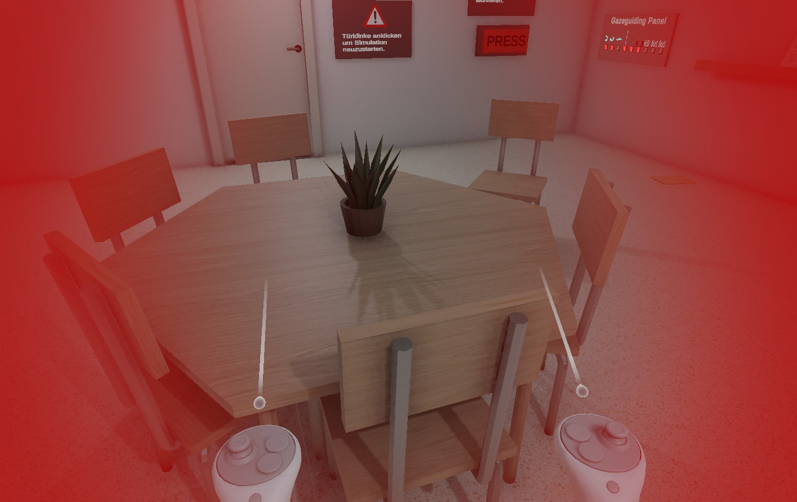
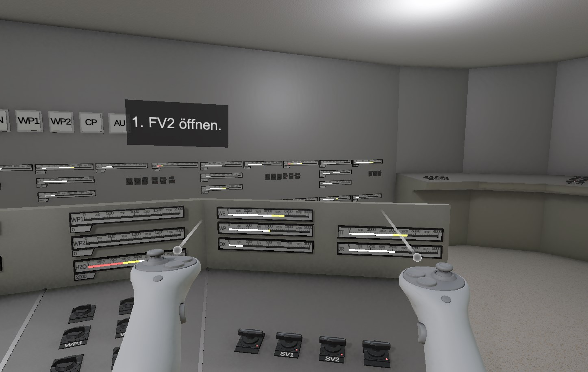
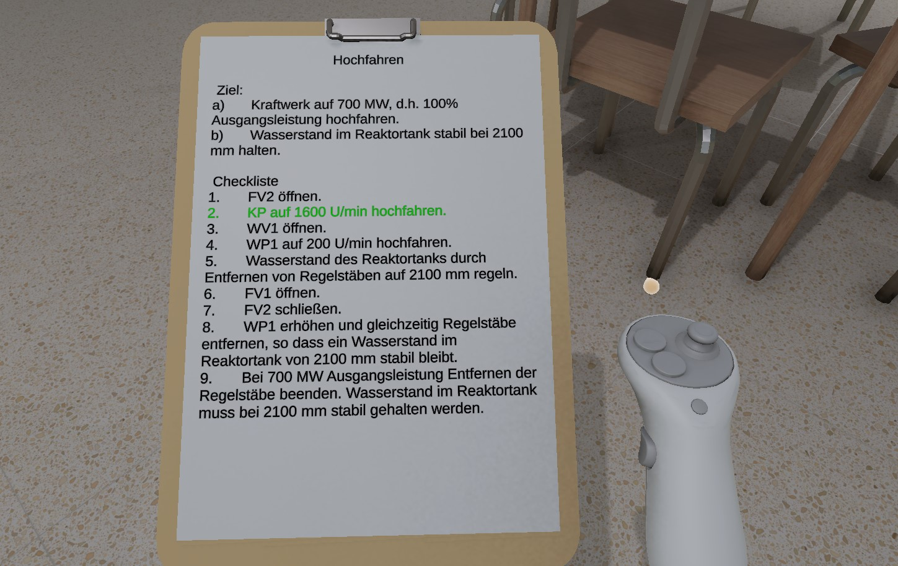
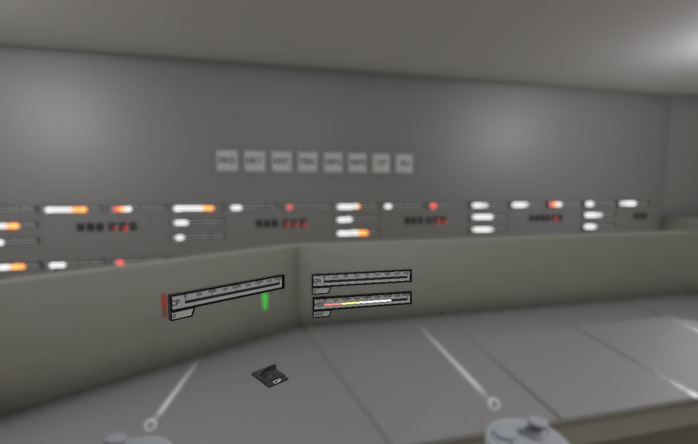

# Gaze Guiding Elemente

- [Rotationspfeile](#rotationspfeile)
- [3D Pfeil](#3d-pfeil)
- [Path Pfeile](#path-pfeile)
- [Anzeige Indikatoren](#anzeige-indikatoren)
- [Direction Cues](#direction-cues)
- [Head Up Display](#head-up-display)
- [Clipboard](#clipboard)
- [Blur Effekte](#objekt-blur)

## Rotationspfeile

## 3D Pfeil

## Path Pfeile

## Anzeige Indikatoren

## Direction Cues

## Head Up Display

## Clipboard

## Blur Effekte

